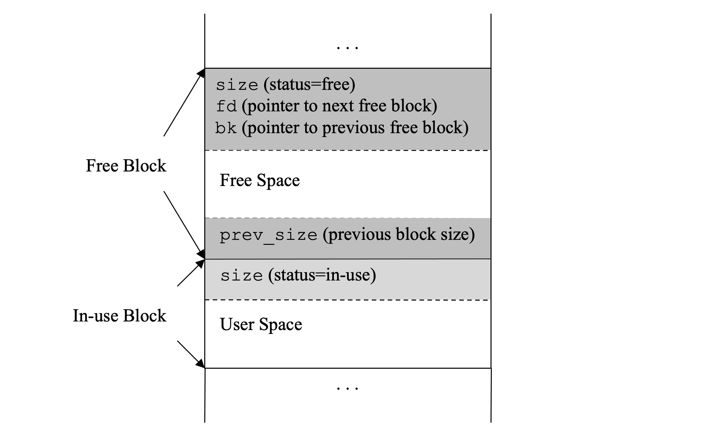

# ptmalloc

Ptmalloc是在Doug Lee的内存分配器上面包了一层并发分配的增强。它是Linux Red Hat发行版和许多其他的系统默认内存管理器。在性能和空间节约角度，在最好的内存管理器中，广受好评。下面的讨论适用于Ptmalloc 2.7.0.

Ptmalloc有两个关键的数据结构来管理堆内存块：边界标签和盒子。它们被声明在文件`malloc/malloc.c`，可以在GNU C运行库glibc里面找到。

一个边界标签是一个小的数据结构，在Ptmalloc里叫做malloc_chunk，每一个内存块里都有，用来记录当前块的大小和状态。因此，在Ptmalloc术语里面，一个chunk是一个块的别名。

XT:chunk和block的中文翻译均为“块”，为了避免混淆，block翻译为“块”，chunk就不翻译了。

```c
struct malloc_chunk {

  INTERNAL_SIZE_T      prev_size;  /* Size of previous chunk (if free)  */
  INTERNAL_SIZE_T      size;       /* Size in bytes, including overhead */

  struct malloc_chunk* fd;         /* double links -- used only if free */
  struct malloc_chunk* bk;
};

```

图2灰色框框的是边界标签。大小字段放在内存块的开始位置，它的最低两个比特表面当前块和前一个内存块是空闲还是使用中。一个使用中的块标签只使用了大小字段，但是一个空闲的内存块标签使用了结构体`malloc_chunk`所有的四个字段。`prev-size`是放置在空闲内存块末尾的另一个大小字段。目的是为了让内存管理器可以合并空闲块。当一个内存块被释放时，Ptmalloc检查编码在大小字段的状态比特。



如果前一个内存块是空闲的，它的开始地址会通过`prev_size `字段来计算，因此这两个内存块可以合并到成一个空闲的块。在`size`字段之后，是两个指针`fd`和`bk`指向其他空闲块的标签。Ptmalloc会使用他们来构建一个空闲块的双链表。当一个应用程序请求一个新的内存块，这个链表会被搜索来找到合适的候选块。因为标签数据结构，一个Ptmalloc管理的内存块的最小大小不会小于结构体`malloc_chunk`的大小，32字节对于64位应用程序。

但是一个被分配的内存块的消耗仅仅有8个字节，也就是`size`字段使用的空间。不同于空闲块，使用中的块不需要双链表的下一个和前一个指针。它同样把块末尾的`prev-size`给吃掉了，因为当它在使用的时候，我们不需要合并这个块。

XT：我之前也写了一篇关于Ptmalloc的简单介绍，可以结合着看https://zhuanlan.zhihu.com/p/534003664
