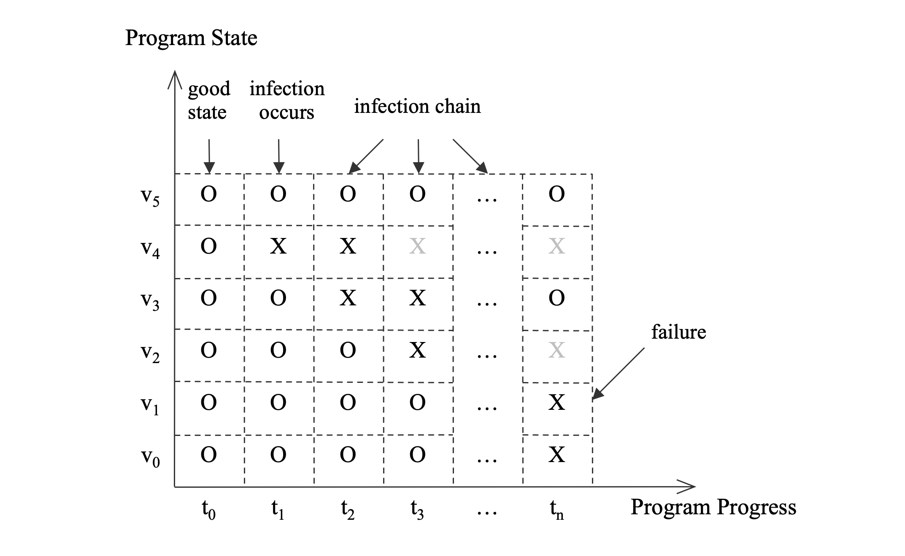

# 调试内存损坏

调试内存损坏真正的挑战是观察到的程序错误没有揭露导致它的错误代码。一个程序通常在有bug的代码作出错误的内存访问的时候不会显示任何症状。但是程序其中一个变量被意外地改变为一个不正确的值；在一些文献中它被叫做传染。这个变量随着程序继续运行会感染其他变量。这些问题传播最终会发展为一个严重的失败：程序要么crash要么生成错误的结果。因为原因和结果的距离，当错误被注意到时候，最后的变量和正在运行的代码通常跟实际的bug不相关和可以展露出很多在时间和位置随机性。

图3-1展示了一个典型的从初始感染变量到最终程序失败的传染链。水平轴代表以时间为刻度的程序的运行（每一个时间事件代表一次程序状态改变）。纵轴是程序的状态，即变量集合。有符号”0“的变量是有效状态，而”X“表示感染了。但是，它不是灾难性的。程序随t2,t3,等等往前进，知道tn。在时间t2，变量v3被感染。在t3，变量v2被感染。在这个时间点，变量v4出了作用域（它的”X“已经灰掉）。当最后的感染变量v1在tn搞垮程序，它已经跟最初的感染点也就是在t1的变量v4距离很远了。注意变量`v2`已经跑出了作用域和变量v3已经从感染状态改成了有效状态。这是有可能的，因为成I徐可能正确地处理了错误的数据尽管它不能反省性的定位和修正错误的原因。对于工程师来说，给定现有的复杂性和各种程序可以达到错误状态的可能性，搞明白第一个感染的变量v4和相关的有错误的代码无疑是非常困难的。


下面的例子展示了违规的代码是怎样没有在犯罪现场留下让我们调查的痕迹。这个简单的程序往一块释放后的内存写入。它最终在一个内存分配函数crash，没有显示一点跟罪犯相关的东西。

```c
#include <stdlib.h>
#include <stdio.h>
#include <string.h>

void AccessFree()
{
    // a temporary array
    long* lArray = new long[10];
    delete lArray;

    // Accee freed memory and corrupt it.
    lArray[1] = 1;
}

void Victim()
{
    void* p = malloc(32);
    free(p);
}

int main(int argc, char** argv)
{
    // program initialization
    void* p = malloc(128);
    char* str = strdup("a string");
    free(p);

    // The initial infection
    AccessFree();

    // more work ...

    // Failure due to previous infection
    Victim();

    return 0;
}
```
在使用了Ptmalloc作为默认内存管理器的Linux Redhat发行版运行这个程序，当程序接收到段错误信号的时候，我们将会看到下面的调用栈。线程正在调用函数`Victim`，简单的在尝试向堆分配32字节。但是，正如在前面章节展示的，这个函数覆写了一块释放的内存因此损坏了堆元数据，更准确的说是用来空闲块链表的指针。这个问题直到为了重用空闲块的时候访问指针才会出现。

```
Program received signal SIGSEGV, Segmentation fault.
0x0000003f53a697e1 in _int_malloc () from /lib64/tls/libc.so.6
(gdb) bt
#0  0x0000003f53a697e1 in _int_malloc () from /lib64/tls/libc.so.6
#1  0x0000003f53a6b682 in malloc () from /lib64/tls/libc.so.6
#2  0x00000000004006ea in Victim () at access_free.cpp:17
#3  0x0000000000400738 in main (argc=1, argv=0x7fbffff4b8) at access_free.cpp:34
```

在这例子，通过简单地审阅代码bug很明显。但是对于不简单的程序，它不会是一个有效的方法。不从例子的原因出发，内存损坏难以调试是清楚的。程序在失败时的状态通常没有足够信息来下任何结论。

## 初始调查

基本上，调试内存损坏是从失败的地方追踪回提交这个开始感染的罪魁祸首代码。如果不是不可能，这会是很难的，即使看上去简单的情况也如此，像上面的例子。但是，我们应该尽可能地发现越多的感染变量，因此我们可以离有问题的代码更近。这个恢复传染链的分析过程需要，最小程度上，程序的深入知识，架构相关的信息和调试器的经验。

当一个问题发现的时候，第一个动作是调查程序的当前状态，即感染链的末尾。这个分析很重要因为它决定了接下来我们有采取的措施。有许多各式各样的方法和风格来获取和分析失败程序的大量信息。下面的列表试图描述一些基本但可触摸的步骤开始步骤。每一个步骤可以缩小搜索的范围和给出下一步的指导。一些步骤仅仅适用于一些场景，如堆分析也许只有在被感染的变量是从堆分配来的才有必要。
